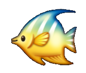
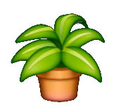

# Fish & Plant Tycoon Fix Patcher

 

🪴 Created with Codex AI. Made with love by Lorsieab2 :) 🐟

An offline Windows patcher combining the current Fish Tycoon Fix Patcher and
Plant Tycoon Fix Patcher in the same player-facing format as the Virtual
Villagers Fun Patcher.

## Supported copies

Only the free Windows downloads from LDW's own site, <https://ldw.com>, are
supported. Every LDW PC game is free there, so there is no reason to source the
games anywhere else. Each engine is pinned to one exact executable identity, and
builds from any other distribution have not been checked against those pins, so
the patcher will refuse them rather than guess.

## Requirements

Windows, and Python 3 with Tkinter (the standard python.org installer includes
it). The launcher uses `py -3` when the Python launcher is present and falls
back to `python`. Nothing else is installed or downloaded, and the patcher
never needs the internet.

## Included fixes

### Fish Tycoon

- Crimson Comet 20% curing fix.
- Unknown Chemical: 3 uses.
- Universal supply slots 2-4 for the eight supported medicine, chemical, and
  egg types.
- Golden Seahorse repurchase, optional and off by default. Lets the Golden
  Seahorse be bought again once owned. It shipped broken in v1.0.6 and was
  repaired in v1.0.11; see
  [docs/golden-seahorse-defects.md](docs/golden-seahorse-defects.md).

### Plant Tycoon

- No old-age plant deaths. The original age check and `Random(1000)` call remain;
  the eligible death range is empty.

## Use

1. Extract the release ZIP.
2. Double-click `Launch Fish and Plant Tycoon Fix Patcher.bat`.
3. Click **Find Both in Parent Folder...** and pick the folder your game
   folders sit in, or select each vanilla folder yourself.
4. Select **One Game** or **Both Games**.
5. Choose the fixes you want, using **Defaults**, **Enable All**, or
   **Disable All** if it is quicker.
6. Validate, dry run, or create the fixed copy/copies.

The GUI remembers separate vanilla and modded paths for both games. Every blue
underlined path is a direct File Explorer link to that folder.

### Finding your games

Point the patcher at the folder that holds your game folders and it fills in
the rest. **Find Both in Parent Folder...** looks for the exact
`Fish Tycoon.exe` and `Plant Tycoon.exe` in that folder and its immediate
subfolders, and fills in the vanilla and modded folder fields for both games.
**Find Fish Tycoon...** and **Find Plant Tycoon...** do the same for one game.
An exact match is required: a missing or ambiguous result is reported rather
than guessed at.

This only fills in a path. Whatever it finds still has to pass the exact
identity check below before anything is written.

### Where the modded copies go

Choose one parent location in the GUI. The patcher creates complete separate
output folders named `Fish Tycoon - Modded` and `Plant Tycoon - Modded`.
Their executables are named `Fish Tycoon - Modded.exe` and
`Plant Tycoon - Modded.exe`. Original folders and executables are not replaced.
The **One Game** tab also retains each original patcher's verified
restore-from-backup operation.

### Where your saves go

Both games build their save path as
`Documents\LDW\<game name>\<exe name><slot>.ldw`. The folder is the game's own
fixed name, and only the file names come from the executable, through the
`%s%d.ldw` format string each build carries.

So a modded copy shares the folder with your original game and writes its own
files beside them:

```
Documents\LDW\Fish Tycoon\
    Fish Tycoon0.ldw            <- original: settings
    Fish Tycoon1.ldw .. 5.ldw   <- original: save slots 1-5
    Fish Tycoon - Modded0.ldw   <- modded: settings
    Fish Tycoon - Modded1.ldw   <- modded: save slots
```

Your original saves are never touched, and the two builds cannot overwrite each
other. Two things follow that are easy to be surprised by:

- Slot `0` holds settings rather than a save, and it is per-executable too, so a
  modded copy starts with fresh settings instead of inheriting the ones from
  your original game.
- Renaming a modded executable changes which `.ldw` files it uses. Rename it and
  its saves appear to vanish; they are still there under the old name.

## Safety

Each engine remains bound to the exact supported stock executable identity,
including SHA-256, size, PE fields, and resource-section hash. Every changed
byte is guarded, expected output hashes are pinned, backups are created, output
files are read back, and the original icon resources remain intact.

When both games are selected, both inputs are dry-run validated before either
output folder is written.

No game executable, save, or original game asset is included in this
repository or release.

## What each patch does

Every setting in the GUI lists the addresses it touches and what it changes,
and every individual byte change carries a note explaining it. Those notes are
written into the patch log next to each change, so a completed run records not
just what bytes moved but why. `docs/fish-tycoon-technical-details.md` and
`docs/plant-tycoon-technical-details.md` go further into the disassembly.

## Tests

```
python tests/test_combined_patcher.py
```

The suite covers the exact executable identities, the pinned output hashes, the
game search, and the GUI wiring. It uses synthetic fixtures only, so it needs
no copy of either game.
